<div align="center">

# 🎉 English Party

**Una ciudad-colegio 3D multijugador para aprender inglés jugando.**
Crea tu *bean*, pasea por las calles, entra en aulas temáticas y aprende, practica, haz el examen o compite en directo contra otros jugadores.


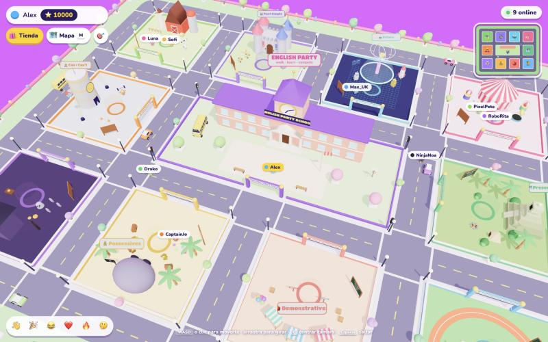

</div>

---

## ✨ Qué tiene

| | |
|---|---|
| 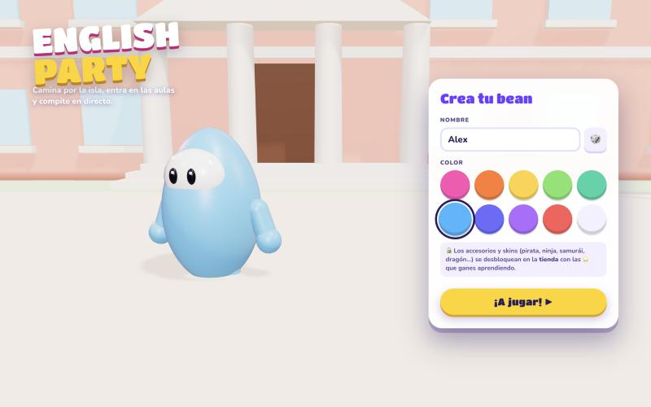 | **Crea tu bean** estilo Fall Guys: nombre y color. Los accesorios y skins se desbloquean con las ⭐ que ganas aprendiendo. |
| 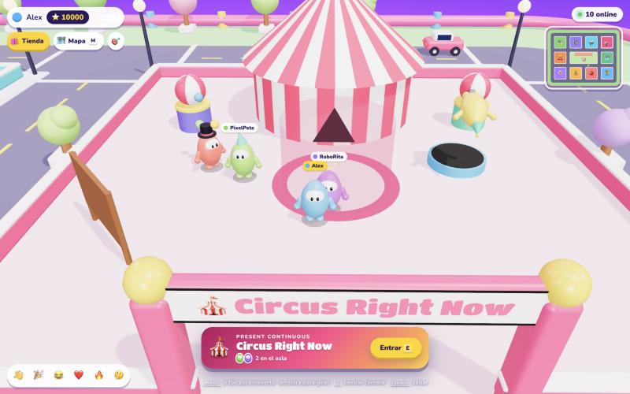 | **10 aulas temáticas** repartidas por la ciudad, cada una con su gramática: castillo medieval (*past simple*), laboratorio de robots (*future*), isla del tesoro (*possessives*), circo (*present continuous*), casa encantada (*prepositions*)… Ves a los demás jugadores en directo. |
| 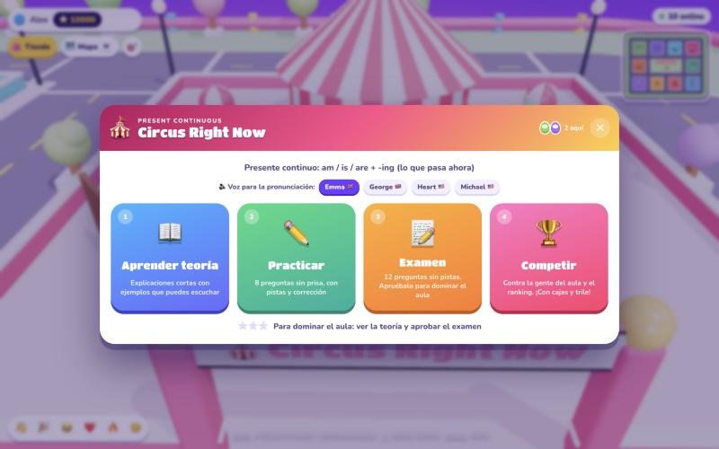 | En cada aula eliges: **📖 Aprender teoría**, **✏️ Practicar**, **📝 Examen** o **🏆 Competir**. Hay 4 voces neuronales para la pronunciación. |
| 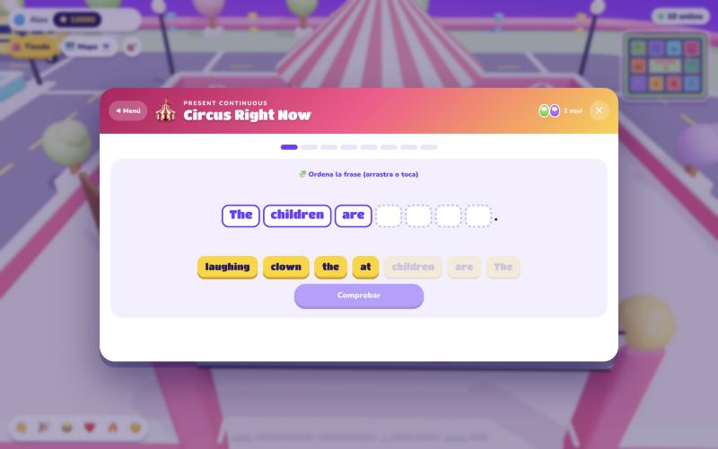 | **4 tipos de ejercicio**: elegir la palabra del hueco, escribir la forma correcta, arrastrar palabras a los huecos y ordenar la frase. Generadores combinatorios: **cientos de frases distintas por aula**, sin repetir las que viste hace poco. |
| 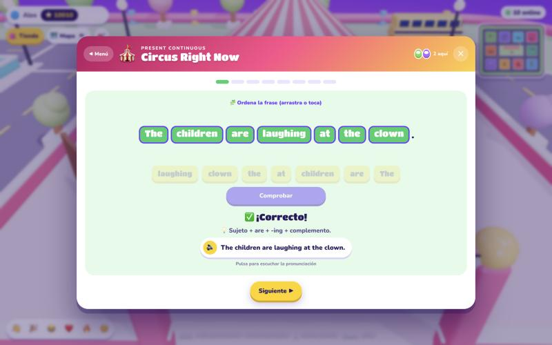 | Corrección al instante con una pista y la frase completa para **escuchar la pronunciación** con voz neuronal (Kokoro TTS). |
| 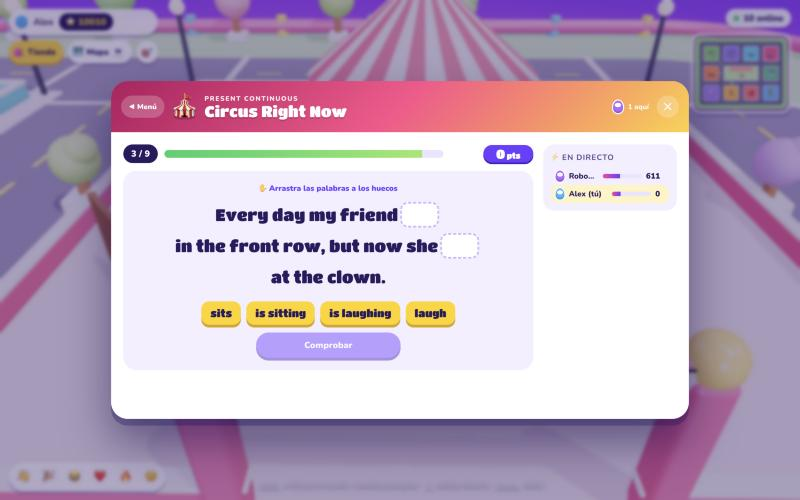 | **Competición en directo** contra la gente del aula: 9 preguntas con tiempo, rachas 🔥, marcador en vivo y ranking por aula. |
| 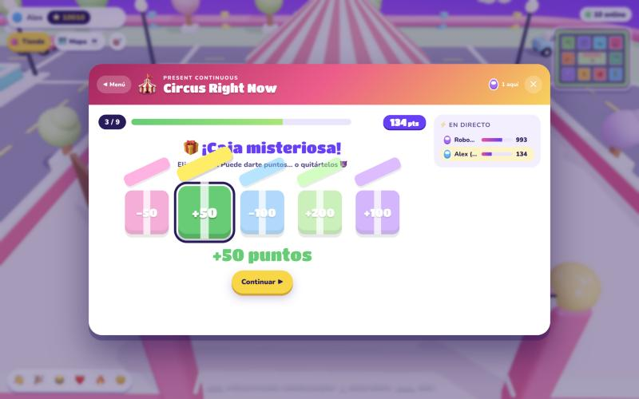 | Cada 3 preguntas, un minijuego: **5 cajas misteriosas** que dan o quitan puntos… |
| 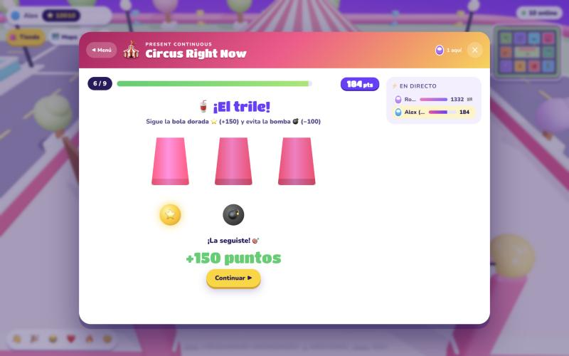 | …o **el trile**: sigue la bola dorada ⭐ entre los vasos y evita la bomba 💣. |
| 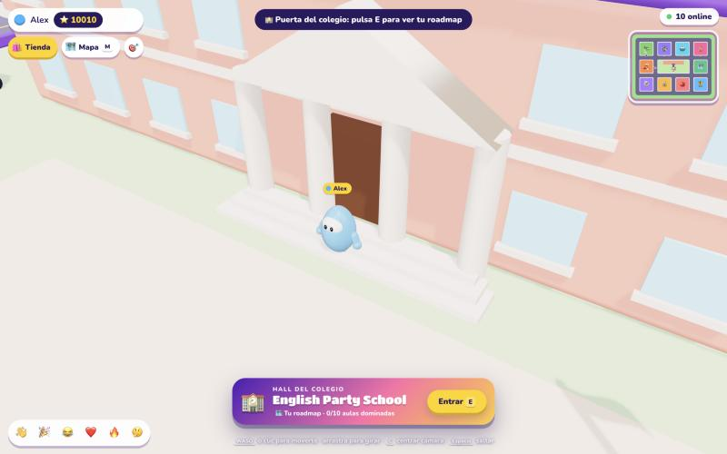 | Entra en el **colegio central**… |
| 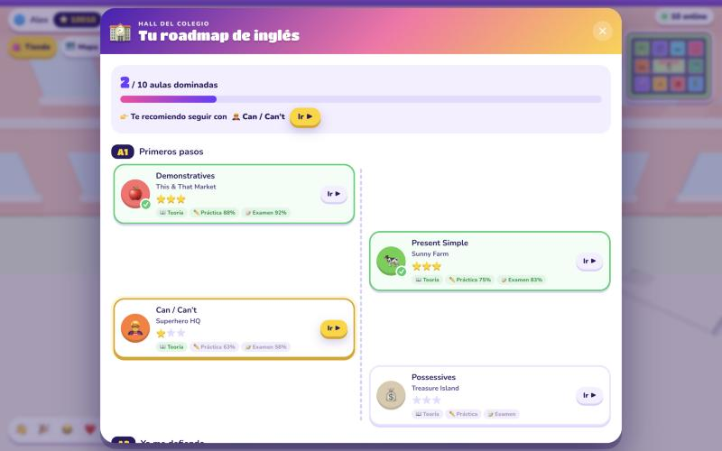 | …y consulta tu **roadmap** por niveles (A1 → A2 → B1): qué aulas dominas (teoría vista + examen aprobado), tu progreso en cada una y cuál te toca después. |
| 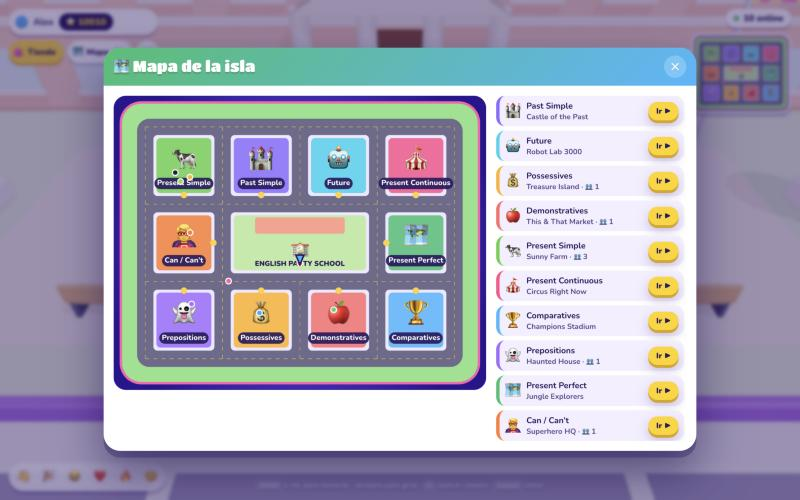 | **Mapa de calles** con todas las lecciones y jugadores en vivo. Pulsa «Ir ▶» y tu bean camina solo hasta el aula. |
| 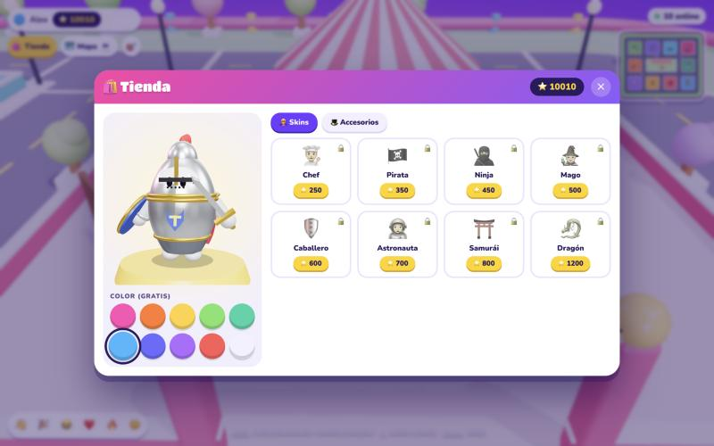 | **Tienda** con vista previa 3D: gasta tus ⭐ en skins y accesorios. |

### 🎭 Skins

| 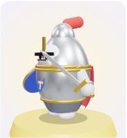 |  | 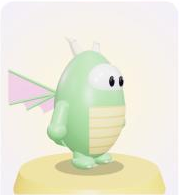 |  |  | 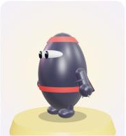 |
|:---:|:---:|:---:|:---:|:---:|:---:|
| Caballero | Pirata | Dragón | Mago | Chef | Ninja |

Y además samurái, astronauta, y accesorios (corona, chistera, gafas de sol, halo…).

---

## 🚀 Arrancarlo en local

Necesitas **Node.js 20 o superior** ([descargar](https://nodejs.org)).

```bash
git clone https://github.com/amlndz/english-party.git
cd english-party
npm install
npm run dev
```

Abre **http://localhost:5173**. Para jugar con otras personas de tu misma red, que abran `http://<IP-de-tu-ordenador>:5173`; en la terminal verás la dirección *Network*.

> 🔊 La primera vez, el servidor descarga el modelo de voz Kokoro (~90 MB) desde Hugging Face y pre-genera los audios de todas las frases del contenido en `.tts-cache/`. Mientras tanto se usa la voz del navegador.

### Controles

| Tecla | Acción |
|---|---|
| `WASD` / flechas o clic en el suelo | Moverte |
| Arrastrar con el ratón · rueda | Girar cámara · zoom |
| `E` | Entrar al aula o al colegio |
| `M` · `T` · `C` | Mapa · tienda · centrar cámara |
| `Espacio` | Saltar (puedes saltar las vallas de las aulas) |
| `1`–`4` | Emotes 👋 🎉 😂 ❤️ |

---

## 🌍 Desplegarlo

El juego es **un único proceso Node** que sirve la web compilada, el WebSocket del multijugador (`/ws`) y la voz (`/api/tts`). Necesitas un hosting que mantenga un proceso Node encendido y admita WebSockets. Plataformas solo estáticas (Vercel o Netlify en modo estático, GitHub Pages) **no sirven**.

### Opción 1 · Cualquier servidor con Node (VPS, Render, Railway…)

```bash
npm install
npm run build
PORT=3000 npm start
```

- **Render / Railway**: crea un *Web Service* desde el repo, con *build command* `npm install && npm run build` y *start command* `npm start`. La plataforma pone `PORT` automáticamente.
- Detrás de un proxy (nginx, Caddy…) acuérdate de dejar pasar las cabeceras de **WebSocket** en `/ws`.

### Opción 2 · Docker (Fly.io, VPS, Cloud Run con min-instances ≥ 1…)

```bash
docker build -t english-party .
docker run -p 3000:3000 -v english-party-tts:/app/.tts-cache english-party
```

El volumen guarda los audios ya generados para no regenerarlos en cada despliegue.

### Requisitos de máquina

- ~1 GB de RAM (el modelo de voz se carga en memoria).
- La primera vez necesita salida a internet para descargar el modelo de voz.

---

## 🧱 Cómo está hecho

| Pieza | Tecnología |
|---|---|
| Mundo 3D | [Three.js](https://threejs.org): todo modelado con primitivas en código, sin assets externos |
| Multijugador | Node + [`ws`](https://github.com/websockets/ws): posiciones en vivo, competición, ranking y bots |
| Voz | [Kokoro TTS](https://github.com/hexgrad/kokoro) vía [`kokoro-js`](https://www.npmjs.com/package/kokoro-js), en el servidor, con caché en disco y cola con prioridad |
| Frontend | Vite + JavaScript sin framework |

```
server.js            Servidor: estáticos, WebSocket, bots y /api/tts
src/content.js       Las 10 aulas: teoría y banco de preguntas
src/generators.js    Generadores de preguntas por tema (variedad infinita)
src/city.js          Plano de la ciudad y rutas por calles (cliente y bots)
src/world.js         Mundo 3D: calles, colegio, tráfico y aulas
src/bean.js          Personaje, accesorios y skins
src/ui.js            Menús de aula, examen, competición y roadmap
src/quiz.js          Motor de preguntas · src/minigames.js cajas y trile
src/shop.js          Tienda con vista previa 3D · src/map.js mapas
```

## ⚠️ Estado: prueba de concepto

- El **progreso, los ⭐ y las compras** se guardan en el navegador (`localStorage`); no hay cuentas de usuario.
- El **ranking** vive en memoria del servidor: se reinicia al reiniciarlo.
- Los **bots** (Luna, Max_UK, NinjaNoa…) existen para que el mundo no se vea vacío, y en el marcador aparecen marcados como *bot*.
